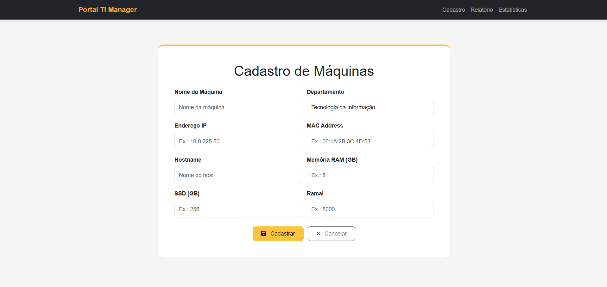
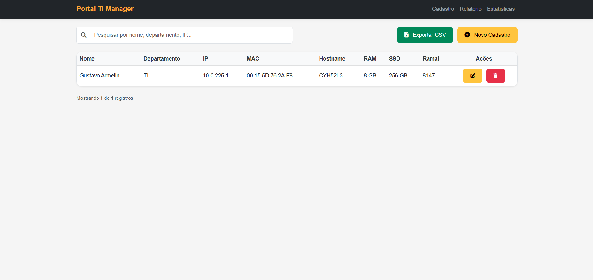
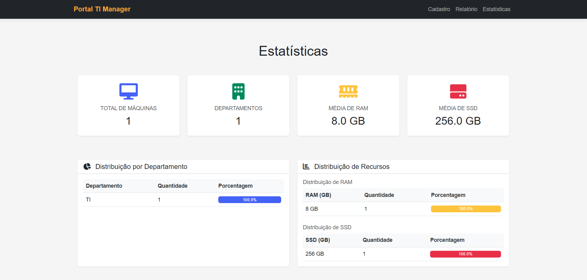

# TI-Manager Portal

Sistema web de cadastro, gestão e monitoramento de ativos de TI. Desenvolvido em Flask, pronto para deploy on-premise com Apache e Systemd.

---

## 📌 Funcionalidades

- Cadastro de ativos de TI (com validação e formatação automática)
- Geração de relatórios com filtros
- Dashboard de estatísticas
- Log de auditoria completo (ações, usuário, IP, data)
- Autenticação com controle de acesso (admin x usuário)
- Exportação de dados em CSV, Excel, PDF
- Interface responsiva e intuitiva

---

## 🚀 Rodar Localmente (modo dev)

```bash
# Clonar o repositório
git clone https://github.com/SEU_USUARIO/ti-manager.git

# Acessar a pasta
cd ti-manager

# Criar ambiente virtual
python3 -m venv venv
source venv/bin/activate

# Instalar dependências
pip install -r requirements.txt

# Rodar o app
python app.py
```

> Acesse em: [http://localhost:5000](http://localhost:5000)

---

## 🔢 Tecnologias Utilizadas

- **Python 3.10**
- **Flask**
- **SQLAlchemy**
- **Bootstrap 5**
- **Apache2**
- **Systemd**
- **MySQL/MariaDB**

---

## 🔢 Pré-Requisitos

- Ubuntu Server 22.04
- Python 3.10+
- Apache2 instalado
- MySQL ou MariaDB instalado
- Permissões de sudo/root

---

## 📂 Instalação no Servidor (Deploy)

### 1. Atualizar o Servidor

```bash
sudo apt update && sudo apt upgrade -y
```

### 2. Instalar Pacotes

```bash
sudo apt install python3 python3-pip python3-venv apache2 -y
```

### 3. Clonar o Projeto

```bash
cd /var/www/
sudo git clone https://github.com/SEU_USUARIO/ti-manager.git
```

### 4. Criar Ambiente Virtual

```bash
cd /var/www/ti-manager
sudo python3 -m venv venv
source venv/bin/activate
pip install -r requirements.txt
```

### 5. Permissões

```bash
sudo chown -R www-data:www-data /var/www/ti-manager
```

---

## 🚧 Configuração do Apache

```bash
sudo a2enmod proxy proxy_http
sudo nano /etc/apache2/sites-available/ti-manager.conf
```

Conteúdo do arquivo:

```apache
<VirtualHost *:80>
    ServerName SEU_DOMINIO_OU_IP

    ProxyPreserveHost On
    ProxyPass / http://127.0.0.1:5000/
    ProxyPassReverse / http://127.0.0.1:5000/

    ErrorLog ${APACHE_LOG_DIR}/ti-manager_error.log
    CustomLog ${APACHE_LOG_DIR}/ti-manager_access.log combined
</VirtualHost>
```

```bash
sudo a2ensite ti-manager.conf
sudo systemctl reload apache2
```

---

## ⚙️ Configuração do Systemd

```bash
sudo nano /etc/systemd/system/ti-manager.service
```

```ini
[Unit]
Description=TI-Manager Portal - Flask Application
After=network.target

[Service]
User=www-data
Group=www-data
WorkingDirectory=/var/www/ti-manager
Environment="PATH=/var/www/ti-manager/venv/bin"
ExecStart=/var/www/ti-manager/venv/bin/python3 app.py

[Install]
WantedBy=multi-user.target
```

```bash
sudo systemctl daemon-reload
sudo systemctl start ti-manager
sudo systemctl enable ti-manager
```

---

## 🚪 Acesso ao Sistema

- URL: `http://SEU_DOMINIO_OU_IP/`

```bash
sudo ufw allow 'Apache Full'
```

---

## 📄 Credenciais Padrão (Demo)

| Tipo | Login | Senha |
|------|--------|--------|
| Admin | admin | admin123 |
| Usuário | user | user123 |

---

## 📊 Telas do Sistema

### Tela de Cadastro



### Tela de Relatório



### Tela de Estatísticas



### Tela de Logs de Auditoria


---

## 🖊️ Personalização

- Atualizar nome do projeto nos arquivos
- Personalizar identidade visual nos templates
- Substituir imagens / logos / avatar

---

## 🌎 .gitignore sugerido

```gitignore
venv/
__pycache__/
instance/
*.pyc
*.db
.env
*.log
.DS_Store
screenshots/*.tmp
```

---

**Desenvolvido com ❤️ por Seu Nome ou Time de TI**  
© 2025 — Portal TI Manager | Todos os direitos reservados.
