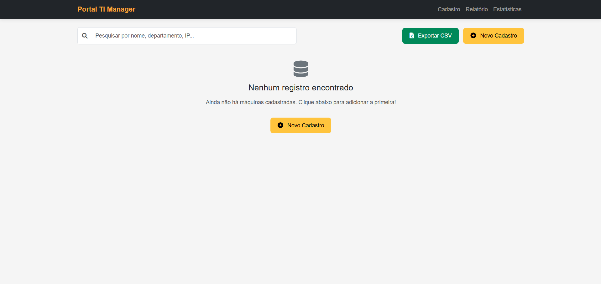
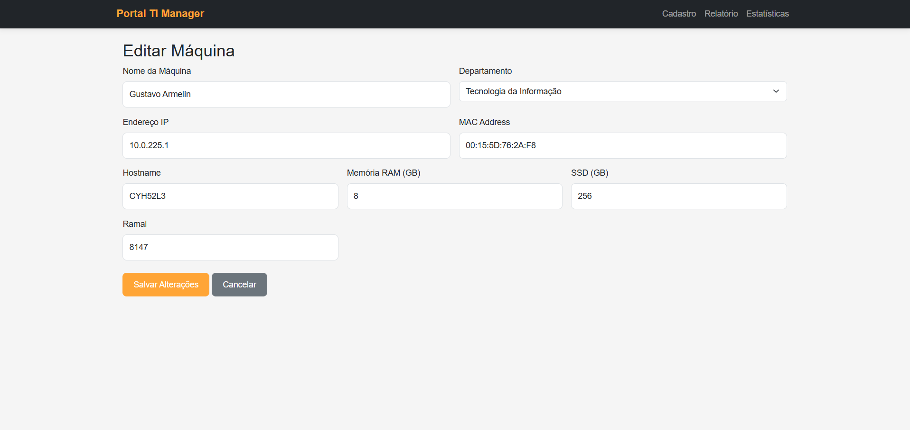

# TI-Manager Portal

Sistema web de cadastro, gestão e monitoramento de ativos de TI. Desenvolvido em Flask, pronto para deploy on-premise com Apache e Systemd.

---

## 📊 Tecnologias Utilizadas

- **Python 3.10**
- **Flask**
- **SQLAlchemy**
- **Bootstrap 5**
- **Apache2**
- **Systemd**
- **MySQL/MariaDB**

---

## 🔢 Pré-Requisitos

- Ubuntu Server 22.04
- Python 3.10+
- Apache2 instalado
- MySQL ou MariaDB instalado
- Permissões de sudo/root

---

## 📚 Instalação e Configuração

### 1. Atualização do Servidor

```bash
sudo apt update && sudo apt upgrade -y
```

### 2. Instalação dos Pacotes Necessários

```bash
sudo apt install python3 python3-pip python3-venv apache2 -y
```

### 3. Clonar o Repositório

```bash
cd /var/www/
sudo git clone https://github.com/<SEU_USUARIO>/<SEU_REPOSITORIO>.git ti-manager
```

### 4. Criar Ambiente Virtual e Instalar Dependências

```bash
cd /var/www/ti-manager
sudo python3 -m venv venv
source venv/bin/activate
pip install -r requirements.txt
```

### 5. Configurar Permissões

```bash
sudo chown -R www-data:www-data /var/www/ti-manager
```

---

## 🛠️ Configuração do Apache

### Ativar os Módulos Necessários

```bash
sudo a2enmod proxy proxy_http
sudo systemctl restart apache2
```

### Criar VirtualHost

```bash
sudo nano /etc/apache2/sites-available/ti-manager.conf
```

Conteúdo do arquivo:

```apache
<VirtualHost *:80>
    ServerName <SEU_DOMINIO_OU_IP>

    ProxyPreserveHost On
    ProxyPass / http://127.0.0.1:5000/
    ProxyPassReverse / http://127.0.0.1:5000/

    ErrorLog ${APACHE_LOG_DIR}/ti-manager_error.log
    CustomLog ${APACHE_LOG_DIR}/ti-manager_access.log combined
</VirtualHost>
```

### Ativar o Site e Reiniciar o Apache

```bash
sudo a2ensite ti-manager.conf
sudo systemctl reload apache2
```

---

## 🛠️ Configuração do Systemd

### Criar Serviço Systemd

```bash
sudo nano /etc/systemd/system/ti-manager.service
```

Conteúdo do arquivo:

```ini
[Unit]
Description=TI-Manager Portal - Flask Application
After=network.target

[Service]
User=www-data
Group=www-data
WorkingDirectory=/var/www/ti-manager
Environment="PATH=/var/www/ti-manager/venv/bin"
ExecStart=/var/www/ti-manager/venv/bin/python3 app.py

[Install]
WantedBy=multi-user.target
```

### Ativar o Serviço

```bash
sudo systemctl daemon-reload
sudo systemctl start ti-manager
sudo systemctl enable ti-manager
```

---

## 🕹️ Acesso ao Sistema

- URL: `http://<SEU_DOMINIO_OU_IP>/`
- Liberar acesso no firewall:

```bash
sudo ufw allow 'Apache Full'
```

---

## 🜍 Telas do Sistema

### Tela de Cadastro

- Formulário vazio:


### Tela de Relatório

- Sem registros:



- Com registros preenchidos:


### Tela de Estatísticas

- Com dados preenchidos:


### Tela de Edição

- Formulário preenchido:



---

## 📖 Personalização

- Atualizar nome do projeto nos arquivos de configuração.
- Personalizar identidade visual nos templates HTML.
- Ajustar domínio e IP conforme necessidade.

---

## 🚀 Status Atual

Sistema em pleno funcionamento para ambientes locais (on-premise), pronto para uso em produção.

---

# 📝 Arquivo .gitignore sugerido

```gitignore
venv/
__pycache__/
instance/
*.pyc
*.pyo
*.pyd
*.db
.env
.DS_Store
screenshots/*.tmp
*.sqlite3
*.log
```

---

**Desenvolvido para ser adaptável para qualquer organização.**

